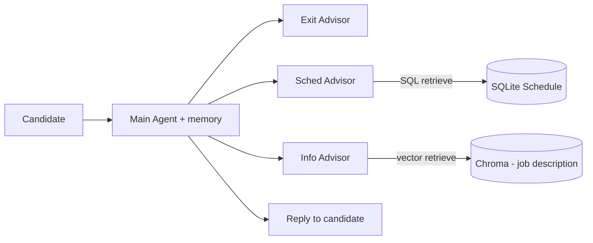

<!-- PROJECT LOGO -->
<p align="center">
  
</p>

<h1 align="center">RecruitAI</h1>

<p align="center">
  A multi-agent recruiting chatbot that answers job questions, offers interview slots, and knows when to stop<br>
  <a href="#usage">View Demo</a>
  ·
  <a href="https://github.com/majdrd/RecruitAI/issues">Report Bug</a>
  ·
  <a href="https://github.com/majdrd/RecruitAI/issues">Request Feature</a>
</p>

---
<br></br>

## Table of Contents

- [About The Project](#about-the-project)
- [Features](#features)
- [Getting Started](#getting-started)
- [Usage](#usage)
- [Screenshots](#screenshots)
- [Code Examples](#code-examples)
- [Project Structure](#project-structure)
- [To-Do List](#to-do-list)
- [Contributing](#contributing)
- [License](#license)
- [Contact](#contact)
- [Acknowledgments](#acknowledgments)

---
<br></br>


## About The Project

> RecruitAI is a proof-of-concept recruiting assistant that holds a conversation with a candidate
> who applied for a Python Developer role. It answers questions about the job from the official job
> description using retrieval, proposes real interview slots from a database, and ends the
> conversation politely when the candidate is no longer interested.

A **Main Agent** owns the conversation and its memory. It never touches the database or the vector
store directly. Instead, on each turn it consults up to three specialised advisors and then decides
what to say.



Each advisor returns a decision, never candidate-facing text. The Exit Advisor answers `end` or
`dont_end`, the Sched Advisor answers `sched` or `dont_sched` and retrieves the three nearest
available slots, and the Info Advisor answers whether the question needs the job description. When
advisors disagree, the priority is **end > schedule > continue**.

<div style="background: #272822; color: #f8f8f2; padding: 10px; border-radius: 8px;">
  <b> Technologies:</b> Python, LangChain, OpenAI API, Chroma, SQLAlchemy, SQLite, Pandas, Streamlit
</div>

---
<br></br>


## Features

- [x] Multi-agent orchestration with a Python control layer
- [x] Conversation memory on the Main Agent
- [x] Retrieval-augmented answers from a PDF job description (Chroma)
- [x] Interview slot lookup from a seeded SQLite calendar
- [x] Exit detection through prompt engineering
- [x] Evaluation against labelled recruiter conversations
- [x] Streamlit chat interface
- [ ] Cloud deployment _(coming soon!)_

---
<br></br>


##  Getting Started

### Prerequisites

- Python >= 3.8
- pip
- An OpenAI API key

### Installation

```bash
git clone https://github.com/majdrd/RecruitAI.git
cd RecruitAI
python3 -m venv .venv
source .venv/bin/activate
pip install -r requirements.txt
cp .env.example .env
```

Then put your OpenAI key in `.env`:

```bash
OPENAI_API_KEY=sk-...
OPENAI_MODEL=gpt-4o
```

---
<br></br>


## Usage

Build the interview calendar and the vector store once, then start the chat:

```bash
python data/seed_schedule.py
python -m app.modules.embedding.embed_pdf
streamlit run streamlit_app/streamlit_main.py
```

Run the tests that do not need the API:

```bash
python -m unittest discover -s tests -p "test_main.py"
```

> The seeded calendar covers **2024**, so use the sidebar in the Streamlit app to simulate a date
> inside that year. There are no Monday or Saturday slots.

---
<br></br>


## Screenshots

_Run `streamlit run streamlit_app/streamlit_main.py` to see the chat interface._

---
<br></br>


## Code Examples

Ask the schedule for the next three available interview slots:

```python
from datetime import datetime
from app.modules.database.db import get_nearest_slots

slots = get_nearest_slots(datetime(2024, 4, 3, 15, 12), position="Python Dev", limit=3)
for slot in slots:
    print(slot.date, slot.time)
```

Handle one conversation turn through the orchestrator:

```python
from app.modules.agents.orchestrator import handle_turn

reply, action = handle_turn(session_id="demo", user_message="Sorry, I'm not interested.")
print(action)  # end
print(reply)
```

---
<br></br>


## Project Structure

```text
RecruitAI/
├── app/
│   ├── main.py
│   └── modules/
│       ├── agents/            # main agent, exit / sched / info advisors, orchestrator
│       ├── database/          # SQLAlchemy access to the Schedule table
│       ├── embedding/         # PDF loading, chunking, Chroma vector store
│       ├── evaluation/        # labelled conversations prepared for scoring
│       ├── prompts/           # prompt files (Identity / Instructions / Examples)
│       └── config.py          # shared paths and environment loading
├── data/
│   ├── Python_Developer_Job_Description.pdf
│   ├── sms_conversations.json
│   └── seed_schedule.py
├── streamlit_app/
│   └── streamlit_main.py
├── tests/
│   ├── test_main.py
│   └── test_evals.ipynb
├── requirements.txt
├── .env.example
├── AGENTS.md
├── CONTRIBUTING.md
└── README.md
```

---
<br></br>


## To-Do List

- [x] Project structure
- [x] Schedule database and slot retrieval
- [x] PDF embedding and job-information retrieval
- [x] Exit, Sched and Info advisors
- [x] Main Agent and orchestrator
- [x] Streamlit interface
- [x] Evaluation notebook
- [ ] Cloud deployment

---
<br></br>


## Contributing

This is a two-person student project. See [CONTRIBUTING.md](CONTRIBUTING.md) for the work split and
the rules for implementing the skeleton.

---
<br></br>


## License

Distributed under the MIT License. See `LICENSE` for more information.

---
<br></br>


## Contact

**Majd** - [majd.rd@gmail.com](mailto:majd.rd@gmail.com)
Project Link: [https://github.com/majdrd/RecruitAI](https://github.com/majdrd/RecruitAI)

---
<br></br>


## Acknowledgments

- [Python](https://www.python.org/)
- [LangChain](https://python.langchain.com/)
- [OpenAI API](https://platform.openai.com/docs/overview)
- [Chroma](https://www.trychroma.com/)
- [SQLAlchemy](https://www.sqlalchemy.org/)
- [Streamlit](https://streamlit.io/)


---
